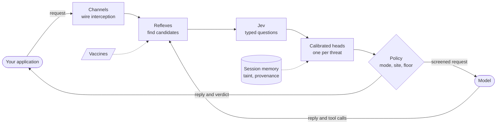

<p align="center">
  <picture>
    <source media="(prefers-color-scheme: dark)" srcset="https://raw.githubusercontent.com/schwarzschlyle/immune/main/docs/assets/immune-logo-dark.png">
    
  </picture>
</p>

<h1 align="center">Immune</h1>

<p align="center">
  <strong>A runtime immune system for LLM applications.</strong><br>
  One call at startup screens every model call your application makes: the prompt going in, the data the model
  reads, the tools it tries to use and the reply coming back.
</p>

<p align="center">
  <a href="https://pypi.org/project/immune-ai/"></a>
  <a href="https://pypi.org/project/immune-ai/"></a>
  <a href="https://github.com/schwarzschlyle/immune/actions/workflows/ci.yml"></a>
  <a href="https://github.com/schwarzschlyle/immune/blob/main/LICENSE"></a>
  <a href="#project-status"></a>
</p>

<p align="center">
  <a href="#installation">Installation</a> &nbsp;&middot;&nbsp;
  <a href="#quickstart">Quickstart</a> &nbsp;&middot;&nbsp;
  <a href="https://github.com/schwarzschlyle/immune/blob/main/notebooks/user_guide/README.md">User guide</a> &nbsp;&middot;&nbsp;
  <a href="https://github.com/schwarzschlyle/immune/blob/main/docs/reference/threats.md">Threat catalog</a> &nbsp;&middot;&nbsp;
  <a href="https://github.com/schwarzschlyle/immune/blob/main/CHANGELOG.md">Changelog</a>
</p>

---

Immune works underneath the SDKs you already use (OpenAI, Anthropic, Google Gemini, Amazon Bedrock and any
OpenAI-compatible server) and every framework built on them, including LangChain and LangGraph. There are no prompts
to rewrite, chains to wrap or callbacks to register:

```python
import immune

immune.init()
```

## Why Immune

LLM applications fail in ways ordinary code does not. A web page the model reads turns into instructions. A link in a
reply carries conversation data to someone else's server. An agent emails a stranger because an email told it to. A
support assistant promises a refund nobody approved.

A system prompt can be argued with, and an input classifier never sees the documents, tool calls and replies where
most of these failures happen. Immune is a layered runtime defense for the whole call:

| Layer | What it does |
| --- | --- |
| **Channels** | Intercepts each call at the HTTP transport and reads it as operator, user, data, output and tool calls, so instructions hidden in data are never mistaken for yours |
| **Reflexes** | Fast in-process checks find exact candidates: a link carrying data, a key-shaped string, a passage copied from the system prompt, an address that only appeared in a document |
| **Judgment** | [TypeSafe Jev](https://typesafe.ai) answers short typed questions about the call and about each candidate; a calibrated head per threat turns the answers into a probability |
| **The floor** | Ten rules (F1 to F10) enforced from the first call. Everything else starts observed, and is enforced per site once its false-alarm rate is provably low |
| **Memory** | Sessions remember what untrusted content was read and where every address came from |
| **Vaccines** | Your own protections, in a small YAML file |

When it acts, Immune makes the smallest change that works: it removes a link, redacts a secret, holds a tool call,
asks the user to confirm, or replaces the reply. Your code receives the usual SDK objects, and a verdict that says
what happened and why.

## Installation

```bash
pip install immune-ai
```

Immune supports Python 3.11 to 3.14 on Linux, macOS and Windows. It reads one key from the environment:

```bash
export TYPESAFE_API_KEY=...        # TypeSafe Jev, which Immune asks about each call
immune doctor --live               # checks the installation with one Jev call
```

| Extra | Adds |
| --- | --- |
| `immune-ai[langsmith]` | Threat runs in your LangSmith traces |
| `immune-ai[otel]` | OpenTelemetry spans and metrics |
| `immune-ai[redis]` | Shared state across workers and hosts |
| `immune-ai[claude-agent]` | Hooks for the Claude Agent SDK |
| `immune-ai[all]` | Everything above |

## Quickstart

Your application code stays as it is. Add Immune at startup, then read the verdict for any call:

```python
import immune
from openai import OpenAI

immune.init()
client = OpenAI()

response = client.chat.completions.create(
    model="gpt-5.4-mini",
    messages=[
        {"role": "system", "content": "You are the support assistant for Pinecrest Outfitters."},
        {"role": "user", "content": "Turn this config into a table: bucket=orders-prod, key=AKIA2E5QZ7XJ4M8RW3TD"},
    ],
)
print(response.choices[0].message.content)  # the key comes back as [redacted]

verdict = immune.verdict(response)
print(verdict.action, verdict.explanation)  # rewrite  rewrite: output.secret_leak
```

A reflex found the key-shaped string, Jev confirmed that the conversation treats it as a real credential, and floor
rule F3 redacted it. Everything else in the reply reached your code unchanged.

The [user guide](https://github.com/schwarzschlyle/immune/blob/main/notebooks/user_guide/README.md) starts with
*10 minutes to Immune* and covers every topic with runnable notebooks and saved outputs.

## Integrations

Frameworks call their models through the same SDKs, so `immune.init()` covers them without changes. For
retrieval-augmented generation, mark retrieved text as data; the model still receives exactly the same prompt:

```python
import immune
from langchain_core.prompts import ChatPromptTemplate
from langchain_openai import ChatOpenAI

immune.init()
prompt = ChatPromptTemplate.from_messages(
    [("system", "Answer from the context."), ("human", "{question}\n\n{context}")]
)
chain = prompt | ChatOpenAI(model="gpt-5.4-mini")
article = "Tents and packs have a 2-year warranty against manufacturing defects, such as broken poles."

with immune.site("help-center"):
    answer = chain.invoke(
        {"question": "Is a broken tent pole covered?", "context": immune.untrusted(article, source="kb:warranty")}
    )
print(answer.content, immune.verdict(answer).action)
```

| | |
| --- | --- |
| **Providers** | OpenAI (Chat Completions, Responses), Anthropic Messages, Google Gemini, Amazon Bedrock Converse, Azure OpenAI, Vertex AI, and OpenAI-compatible servers such as vLLM, Ollama, LiteLLM, OpenRouter, Groq and Mistral |
| **Frameworks** | LangChain, LangGraph, LlamaIndex, LiteLLM, CrewAI, DSPy, Pydantic AI, OpenAI Agents SDK, Instructor, Haystack, and the Claude Agent SDK through hooks |
| **Call styles** | Streaming and non-streaming, sync and async, tool calls, structured outputs |
| **Deployments** | Local state for one process, SQLite for one host, Redis for a fleet, with failover to memory |

| To protect | Use |
| --- | --- |
| Every LLM call in the process | `immune.init()` at startup |
| One client, keeping its proxies, timeouts and hooks | `client = immune.protect(OpenAI())` |
| A block of code, such as a script or a test | `with immune.protected(): ...` |

## How it works



Code nominates and Jev decides: reflexes are exact about *what* they find, and Jev judges what it *means*. A passage
copied from your system prompt is redacted when it is private guidance and passes when it is the menu the customer
asked for. Input screening runs in parallel with your model call; output screening adds one Jev round trip after the
model finishes. The [concepts guide](https://github.com/schwarzschlyle/immune/blob/main/notebooks/user_guide/02_concepts.ipynb)
explains the model in full, including the biology behind the name.

## Threat coverage

The 49 built-in threats map onto the OWASP Top 10 for LLM Applications (2025) and for Agentic Applications (2026).

| Risk | What Immune does | Threats | Floor |
| --- | --- | --- | --- |
| **LLM01** Prompt Injection | Strips hidden and smuggled text, neutralizes instructions planted in documents and tool results, flags overrides and jailbreak framing | 19 | F1, F7, F8 |
| **LLM02** Sensitive Information Disclosure | Redacts secrets in replies and holds tool calls that would carry them out | 4 | F3, F5 |
| **LLM05** Improper Output Handling | Removes exfiltrating links and script-capable markup; flags destructive commands | 3 | F2 |
| **LLM06** Excessive Agency | Holds actions aimed at destinations only untrusted content named; confirms irreversible ones | 5 | F4, F10 |
| **LLM07** System Prompt Leakage | A canary and copy detection redact leaked instructions | 4 | F3 |
| **LLM09** Misinformation | Flags ungrounded claims, false "done" claims and invented prices | 4 | — |
| **LLM10** Unbounded Consumption | Stops tool loops; flags off-task and bulk-output requests | 3 | F6 |
| **ASI01** Agent Goal Hijack | Neutralizes planted instructions and stops the links and actions they try to cause | 7 | F1, F2, F4, F7 |
| **ASI02** Tool Misuse and Exploitation | Checks every tool call's destination, payload and reversibility | 4 | F4, F5, F10 |
| **ASI04** Agentic Supply Chain | Detects poisoned, shadowing or changed MCP tool descriptions | 1 | — |
| **ASI05** Unexpected Code Execution | Parses shell and SQL to flag destructive commands | 1 | — |
| **ASI06** Memory and Context Poisoning | Neutralizes instructions in retrieved content before the model reads it | 1 | F7 |
| **ASI08** Cascading Failures | Breaks runaway tool loops | 1 | F6 |
| **ASI09** Human-Agent Trust Exploitation | Flags claims to be human, false action claims, requests for secrets and manipulation | 4 | — |

Immune also covers duty of care (crisis resources and protections for minors) and business commitments. The
[threat catalog](https://github.com/schwarzschlyle/immune/blob/main/docs/reference/threats.md) lists every threat,
how it is decided and what your application receives.

## Configuration

Immune needs no configuration. When you want to pin a site's profile or enforce a detector, add an `immune.yaml`
next to your application:

```yaml
mode: auto                            # auto | observe | strict | off
sites:
  support-chat:                       # name it in code with: with immune.site("support-chat"):
    user_facing: true                 # risky tool calls become confirmation questions
    enforce: [input.off_task]
    allowed_destinations: [pinecrest.example]
    tools:
      issue_refund: {writes_state: true, irreversible: true}
  internal-playground:
    enabled: false                    # not screened
```

| Mode | Behavior |
| --- | --- |
| `auto` (default) | The floor is enforced from the first call; other detectors are observed until enforced or promoted per site |
| `observe` | Verdicts record what *would* have happened; only crisis support acts |
| `strict` | Every threat is enforced at its threshold |
| `off` | Calls pass straight through |

`immune.configure(...)` changes settings live, `IMMUNE_MODE=observe` sets the mode for a deployment, and
`IMMUNE_DISABLED=1` turns Immune off without a code change. The
[configuration guide](https://github.com/schwarzschlyle/immune/blob/main/docs/guides/configuration.md) documents
every setting and default.

## Custom protections

A vaccine teaches Immune one threat specific to your product. It compiles into the same pipeline as the built-in
threats and starts observed:

```yaml
id: pinecrest.no_competitor_recommendations
title: The reply recommends a competitor
description: The reply suggests the customer shop at a rival store instead of Pinecrest Outfitters.
stage: output
detect:
  keywords: ["TrailMart", "Summit Supply"]
  confirm: jev                       # Jev confirms each match, so innocent mentions pass
respond:
  message: "I can only help with Pinecrest Outfitters products."
tests:
  positives: ["You could try TrailMart for kayaks."]
  negatives: ["We stock two-person tents and sleeping pads."]
```

```bash
immune vaccines test                                   # every vaccine passes its own examples
immune vaccines trial pinecrest.no_competitor_recommendations --corpus replies.jsonl
```

Detectors can be keywords, bounded regular expressions, questions for Jev, tool-call rules or Python functions. See
the [vaccines guide](https://github.com/schwarzschlyle/immune/blob/main/docs/guides/vaccines.md).

## Testing

`immune.testing` runs your real code through a real Immune runtime against a scripted model, offline and without
keys. The pytest fixture is installed with the package:

```python
from immune.testing import FakeReply


def test_keys_never_reach_customers(immune_harness):
    harness = immune_harness(script=FakeReply("Your key is AKIA2E5QZ7XJ4M8RW3TD."))
    reply = harness.openai().chat.completions.create(
        model="gpt-5.4-mini", messages=[{"role": "user", "content": "What is my key?"}]
    )
    assert "AKIA2E5QZ7XJ4M8RW3TD" not in reply.choices[0].message.content
```

The harness also replays Immune's library of reconstructed, publicly reported incidents through your own code
(`immune replay`), and records real Jev answers once for deterministic CI.

## Observability

Every verdict is available in code, and flows to the tools you already run:

- `immune.verdict(response)` and `immune.on_verdict(callback)` for your logs and metrics
- an `immune.screen` OpenTelemetry span per call, and spike alerts through `immune.on_alert(callback)`
- LangSmith runs for calls with a possible threat, nested in your application's trace (`immune-ai[langsmith]`)
- an optional JSON Lines audit log (`privacy.verdict_log`)

## Data and privacy

To screen a call, Immune sends the relevant text to TypeSafe's Jev API, with personal data and secrets masked first.
`privacy.profiling: local` keeps system prompts in your process. Nothing is sent to the Immune project. The
[data flows](https://github.com/schwarzschlyle/immune/blob/main/docs/security/data-flows.md) page lists every field.

## Project status

Immune `0.1.0` is a **pre-release**. It follows [Semantic Versioning](https://semver.org/): while the version is
`0.x`, minor releases may change the API, and every change is recorded in the
[changelog](https://github.com/schwarzschlyle/immune/blob/main/CHANGELOG.md).

- The floor is covered by tests and by replays of publicly reported incidents; with live Jev, every floor candidate
  in the incident library is confirmed, and none of the 130 packaged everyday samples nominates one.
- The detector heads ship with provisional weights; train them on your own labeled traffic with `immune evidence`.
  That is why detectors outside the floor start observed.
- Jev adds about 340 to 430 ms at the median to non-streamed replies and about 2,500 tokens per screened call. If Jev
  is slow or unreachable, floor candidates are acted on without it, and Immune fails open by default.

Immune reduces risk in layers; it does not claim that prompt injection is solved. See the
[current limitations](https://github.com/schwarzschlyle/immune/blob/main/docs/guides/developer-guide.md#16-current-limitations).

## Documentation

| Guide | Contents |
| --- | --- |
| [User guide](https://github.com/schwarzschlyle/immune/blob/main/notebooks/user_guide/README.md) | 18 notebooks: tutorial, concepts, OpenAI, LangChain and LangGraph integration, production, API reference and cookbook |
| [Developer guide](https://github.com/schwarzschlyle/immune/blob/main/docs/guides/developer-guide.md) | Configuration, sites, vaccines, testing and CI, operations |
| [Project setup](https://github.com/schwarzschlyle/immune/blob/main/docs/guides/setup.md) | Where `immune.yaml`, vaccines, scenarios and tests live, with a starter project |
| [Examples](https://github.com/schwarzschlyle/immune/tree/main/examples) | A starter project, a showcase application with a web inspector, notebooks and a feature tour |
| [Reference](https://github.com/schwarzschlyle/immune/blob/main/docs/reference/threats.md) | Threat catalog, [configuration](https://github.com/schwarzschlyle/immune/blob/main/docs/guides/configuration.md) and [command line](https://github.com/schwarzschlyle/immune/blob/main/docs/reference/cli.md) |
| [Security](https://github.com/schwarzschlyle/immune/blob/main/docs/security/threat-model.md) | Immune's own threat model and [security policy](https://github.com/schwarzschlyle/immune/blob/main/SECURITY.md) |

## Contributing

Contributions are welcome. Read the [contributing guide](https://github.com/schwarzschlyle/immune/blob/main/CONTRIBUTING.md)
and [governance](https://github.com/schwarzschlyle/immune/blob/main/GOVERNANCE.md), and report vulnerabilities
privately as described in the [security policy](https://github.com/schwarzschlyle/immune/blob/main/SECURITY.md).

## License

Apache License 2.0. Immune is an independent open-source project, not affiliated with or endorsed by TypeSafe AI; use
of Jev is subject to TypeSafe's terms.
